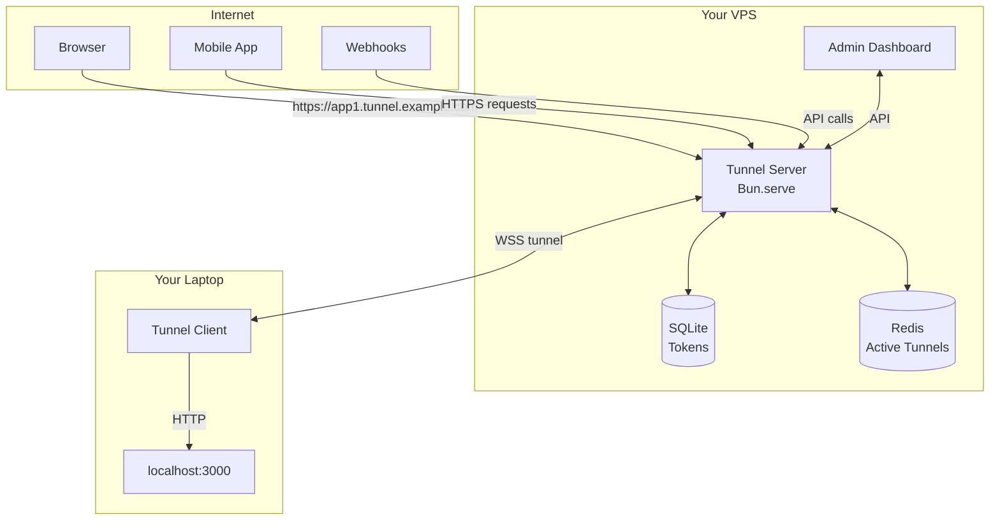
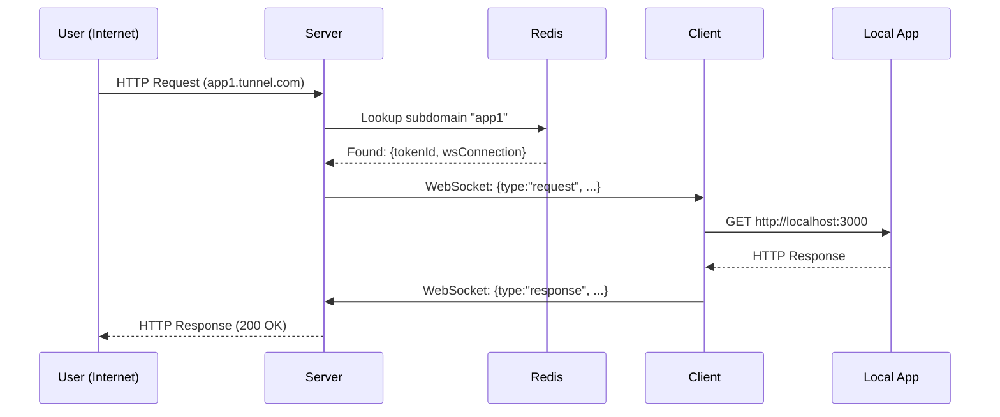
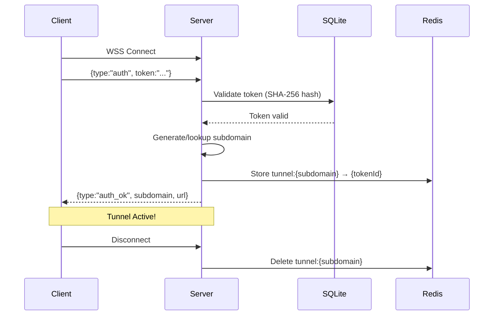

# local-to-pub

**100% Self-hosted tunnel server** - Expose localhost to the internet. No limits, no third-party data, no bandwidth restrictions.

[](https://opensource.org/licenses/MIT)

## Why?

| Feature | ngrok (Free) | local-to-pub |
|---------|-------------|--------------|
| Subdomains | 1 | Unlimited |
| Bandwidth | 1 GB/mo | Unlimited |
| Custom domains | Paid | Free |
| Self-hosted | No | Yes |
| Traffic inspector | Paid | Free |

## Features

- **Unlimited tunnels** on your domain
- **100% self-hosted** - your VPS, your rules
- **No bandwidth limits**
- **Complete privacy** - no third-party servers
- **SHA-256 token auth** with full CRUD management
- **Admin dashboard** with live traffic inspector
- **Persistent subdomains** for your projects
- **Self-contained binary** for easy deployment

## Quick Start

### Server (VPS)

```bash
curl -s https://raw.githubusercontent.com/JuniYadi/local-to-pub/refs/heads/main/install.sh | bash -s -- --server
```

Set required env vars:
```bash
export ADMIN_USERNAME="admin"
export ADMIN_PASSWORD="your-password"
export ADMIN_SESSION_SECRET="random-secret"
export BASE_DOMAIN="tunnel.example.com"
```

### Client (Local)

```bash
curl -s https://raw.githubusercontent.com/JuniYadi/local-to-pub/refs/heads/main/install.sh | bash -s -- --client

# Create config
mkdir -p ~/.tunnel
echo '{"server":"wss://tunnel.example.com/tunnel","token":"YOUR_TOKEN"}' > ~/.tunnel/config.json

# Start tunnel
bun run start --port 3000
```

## Admin Panel

Access at `http://your-server/` after configuring admin credentials.

Features:
- Generate/delete tokens
- Reserve persistent subdomains
- Live traffic inspector (SSE)
- Session management

## Token Management

1. Log in to admin panel
2. Click "Generate New Token"
3. Copy token (shown once only)
4. Assign subdomain via "Edit" button

## Binary Distribution

```bash
# Build standalone binary with embedded frontend
bun run build:server

# Output: packages/server/server-bin
./packages/server/server-bin
```

## Configuration

| Variable | Description | Default |
|----------|-------------|---------|
| `PORT` | Server port | `3000` |
| `BASE_DOMAIN` | Tunnel domain | `localhost:3000` |
| `REDIS_URL` | Redis URL | `redis://localhost:6379` |
| `ADMIN_USERNAME` | Admin username | (required) |
| `ADMIN_PASSWORD` | Admin password | (required) |
| `ADMIN_SESSION_SECRET` | Session signing | (required) |

## CLI Options

```
tunnel -p <port>     Local port (default: 3000)
tunnel -h <host>     Local host (default: localhost)
tunnel -s <url>      Server WebSocket URL
tunnel -t <token>    Auth token
```

## Architecture



## Data Flow



## Connection Lifecycle



## Security

- **Tokens**: SHA-256 hashed (never stored plaintext)
- **Sessions**: HMAC-signed, 12hr TTL, HttpOnly cookies
- **Production**: Secure + SameSite=Strict cookies

## API Reference

| Method | Endpoint | Description |
|--------|----------|-------------|
| POST | `/api/login` | Admin login |
| POST | `/api/logout` | Admin logout |
| GET | `/api/me` | Check session |
| GET | `/api/tokens` | List tokens |
| POST | `/api/tokens` | Generate token |
| DELETE | `/api/tokens/:id` | Delete token |
| POST | `/api/tokens/subdomain` | Set subdomain |
| GET | `/health` | Health check |
| GET | `/api/inspector/stream` | Live events (SSE) |
| WS | `/tunnel` | WebSocket tunnel |

## Troubleshooting

**Connection issues:**
- "Tunnel not connected" → Check client is running
- "Invalid token" → Regenerate from admin panel
- "Subdomain in use" → Disconnect other client

**DNS setup:**
```
A     tunnel.example.com      → YOUR_VPS_IP
A     *.tunnel.example.com    → YOUR_VPS_IP
```

## Development

```bash
bun test                    # All tests
bun test packages/server    # Server tests
bun test packages/client    # Client tests
bun run dev:server          # Dev server (HMR)
bun run dev:client          # Dev client
```

## License

MIT
